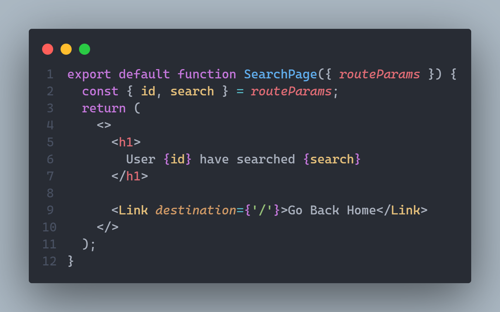

# Creating React Router from scratch

In this project im creating the library <a href='https://reactrouter.com/en/main'>React Router</a> from scratch with React, this made library is going to be published by npm so anyone who want can install it and import it in his projects.

Also im adding Tests and the '<a href='https://reactrouter.com/en/main/components/link'>&lt;Link&gt;</a>' component to perform SPA (Single Page Application).

In order to create React Router from scratch, this steps were followed:

1 - Create a way of doing MPA (Multi Page Applications), done this by using conditional rendering and a state, using this as a start point.

2 - Create a way of doing SPA (Single Page Applications), by creating a function to manipulate browser history. I add a new entry to the browser session by creating a custom even, that will be heard when a pages gets loaded (or page Component gets mounted).

3 - The event gets listened by a component called &lt;Router&gt;, this component will hear the Event dispatched in the previous step, and by using a state it will set the current path of the browser to the added entry.

4 - Exported Event creation and dispatch (step 2) to a Component called &lt;Link&gt;, that will "link" pages based on a specified endpoint.

5 - Added a default component in &lt;Router&gt; component, when an endpoint is not defined or found.

6 - Support routes with parameters, i've used 'path-to-regexp' module. In order to pass parameters through URL.

First we need to indicate in the URL that we are going to pass dynamic parameters, so when declaring the routes with its component we add expected parameters, like this.

Then we create the Page Component, declaring props.

if URL = 'url/search/123/pasta' -> routeParams  = { id : '123', search : 'pasta' } 

Finally &lt;Router&gt; Component will compare the current URL in browser against the routes declared in the above constant. If the URL contains '/search' then by using 'match' function in 'path-to-regexp' module, we obtain the dynamic parameters and pass it to the 'SearchPage' Component.

    if URL = 'url/search/123/pasta' -> routeParams  = { id : '123', search : 'pasta' }
